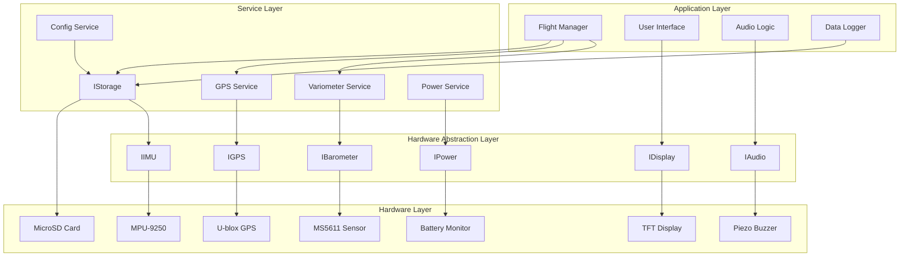
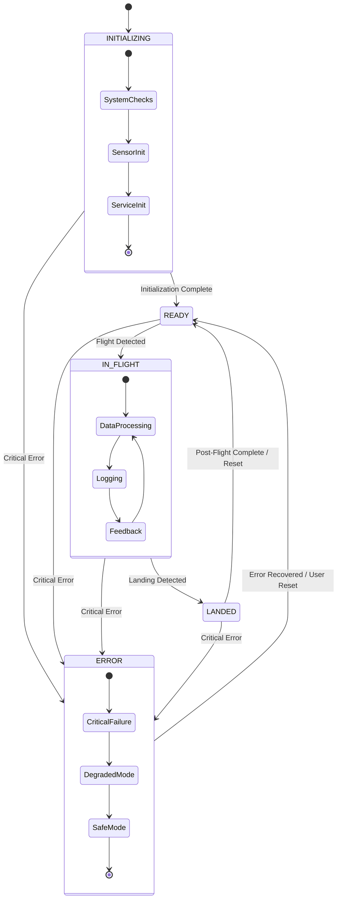
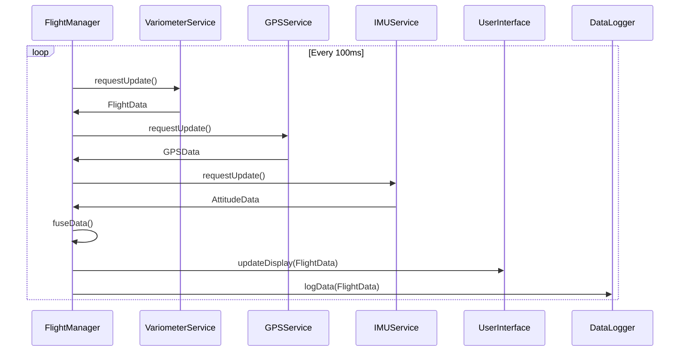

# BayuPandu Firmware Core Design Document

## Overview

The BayuPandu firmware implements a professional-grade paragliding flight computer on the ESP32 platform. The architecture follows a layered approach with a Hardware Abstraction Layer (HAL) enabling testable, modular code. The system integrates multiple sensors (barometric, GPS, IMU), provides real-time flight data processing with advanced filtering algorithms, and delivers both visual and audio feedback to pilots.

The firmware is designed for reliability in flight-critical applications, with comprehensive error handling, graceful degradation, and fail-safe operation modes. All flight data is logged in FAI-compliant IGC format for competition use.

## Architecture

### System Architecture Overview



### Core Components

1. **Flight Manager**: Central coordinator managing flight state and data flow
2. **Service Layer**: Business logic for each major subsystem
3. **HAL Interfaces**: Abstract hardware interfaces enabling testing and modularity
4. **Hardware Implementations**: Concrete implementations for physical components

## Components and Interfaces

### Hardware Abstraction Layer (HAL)

#### IBarometer Interface
```cpp
class IBarometer {
public:
    virtual bool initialize() = 0;
    virtual bool readPressure(float& pressure) = 0;
    virtual bool readTemperature(float& temperature) = 0;
    virtual float calculateAltitude(float pressure, float seaLevelPressure = 1013.25) = 0;
    virtual bool isHealthy() = 0;
    virtual ~IBarometer() = default;
};
```

#### IGPS Interface
```cpp
class IGPS {
public:
    virtual bool initialize() = 0;
    virtual bool hasValidFix() = 0;
    virtual GPSData getCurrentPosition() = 0;
    virtual bool update() = 0;
    virtual uint8_t getSatelliteCount() = 0;
    virtual float getHDOP() = 0;
    virtual ~IGPS() = default;
};
```

#### IIMU Interface
```cpp
class IIMU {
public:
    virtual bool initialize() = 0;
    virtual bool calibrate() = 0;
    virtual bool readAcceleration(Vector3& accel) = 0;
    virtual bool readGyroscope(Vector3& gyro) = 0;
    virtual bool readMagnetometer(Vector3& mag) = 0;
    virtual AttitudeData getAttitude() = 0;
    virtual bool isCalibrated() = 0;
    virtual ~IIMU() = default;
};
```

### Service Layer Components

#### VariometerService
- **Purpose**: Processes barometric data and calculates vertical speed
- **Key Features**:
  - Kalman filter implementation for smooth readings
  - Configurable averaging windows
  - Thermal detection algorithms
  - Audio tone generation logic
- **Dependencies**: IBarometer, IAudio, ConfigService

#### GPSService
- **Purpose**: Manages GPS data acquisition and processing
- **Key Features**:
  - Position tracking and navigation calculations
  - Speed and heading computation
  - Flight detection algorithms
  - Waypoint management
- **Dependencies**: IGPS, ConfigService

#### FlightLogger
- **Purpose**: Records flight data in IGC format
- **Key Features**:
  - Automatic flight detection and logging
  - IGC format compliance with security records
  - File management and rotation
  - Data integrity verification
- **Dependencies**: IStorage, GPSService, VariometerService

### Application Layer

#### FlightManager
- **Purpose**: Central coordinator managing overall system state
- **Responsibilities**:
  - System initialization and health monitoring
  - Flight state machine management
  - Sensor data fusion and validation
  - Error handling and recovery
  - Power management coordination

##### State Diagram



#### UserInterface
- **Purpose**: Manages display output and user input
- **Framework**: LVGL (Light and Versatile Graphics Library)
- **Features**:
  - Multiple display screens (flight, navigation, settings) created using LVGL widgets.
  - Button input handling integrated with LVGL's event system.
  - Screen brightness management
  - Status indicators and alerts

## Data Models

### Core Data Structures

#### FlightData
```cpp
struct FlightData {
    float altitude;           // meters MSL
    float verticalSpeed;      // m/s
    float pressure;           // hPa
    float temperature;        // °C
    GPSData gpsData;
    AttitudeData attitude;
    uint32_t timestamp;       // milliseconds since boot
    bool isValid;
};
```

#### GPSData
```cpp
struct GPSData {
    double latitude;          // degrees
    double longitude;         // degrees
    float altitude;           // meters MSL
    float speed;              // m/s
    float heading;            // degrees
    uint8_t satellites;
    float hdop;               // horizontal dilution of precision
    uint32_t timestamp;       // GPS time
    bool hasValidFix;
};
```

#### AttitudeData
```cpp
struct AttitudeData {
    float pitch;              // degrees
    float roll;               // degrees
    float yaw;                // degrees (magnetic heading)
    Vector3 acceleration;     // m/s²
    Vector3 angularVelocity;  // rad/s
    bool isCalibrated;
};
```

#### SystemConfig
```cpp
struct SystemConfig {
    // Variometer settings
    float varioSensitivity;
    float audioVolume;
    float liftThreshold;
    float sinkThreshold;
    
    // Display settings
    uint8_t brightness;
    uint16_t screenTimeout;
    
    // GPS settings
    float qnhPressure;        // Sea level pressure for altitude calculation
    
    // Power settings
    float lowBatteryWarning;
    float criticalBatteryLevel;
    
    // Logging settings
    bool autoStartLogging;
    uint16_t loggingInterval; // seconds
};
```

### Data Flow Architecture



## Error Handling

### Error Classification

1. **Critical Errors**: System-threatening issues requiring immediate action
   - Memory allocation failures
   - Watchdog timer expiration
   - Power system failures

2. **Sensor Errors**: Individual component failures with graceful degradation
   - Barometer communication failure
   - GPS signal loss
   - IMU calibration errors

3. **Storage Errors**: Data persistence issues
   - MicroSD card failures
   - File system corruption
   - Configuration loading errors

### Error Recovery Strategies

#### Sensor Failure Recovery
```cpp
class SensorHealthMonitor {
private:
    uint32_t consecutiveFailures[SENSOR_COUNT];
    bool sensorEnabled[SENSOR_COUNT];
    
public:
    void reportSensorFailure(SensorType sensor);
    void reportSensorSuccess(SensorType sensor);
    bool isSensorHealthy(SensorType sensor);
    void disableSensor(SensorType sensor);
    void attemptSensorRecovery(SensorType sensor);
};
```

#### System Recovery Modes
1. **Normal Operation**: All systems functional
2. **Degraded Mode**: Some sensors offline, core functionality maintained
3. **Safe Mode**: Minimal functionality, basic variometer and display only
4. **Emergency Mode**: Critical battery, data preservation priority

### Watchdog Implementation
- Hardware watchdog timer reset every main loop iteration
- Software watchdog for detecting infinite loops in services
- Automatic system reset with error logging on watchdog expiration

## Testing Strategy

### Unit Testing Framework
- **Platform**: PlatformIO Unity testing framework
- **Mock Objects**: Simulated HAL implementations for hardware-independent testing
- **Coverage**: All service layer components and algorithms

### Test Categories

#### Algorithm Testing
```cpp
// Example: Kalman filter testing
void test_kalman_filter_convergence() {
    KalmanFilter filter(0.1, 0.1, 0.01);
    
    // Inject known signal with noise
    for (int i = 0; i < 100; i++) {
        float noisyValue = 100.0 + sin(i * 0.1) + random(-1, 1);
        float filtered = filter.update(noisyValue);
        
        if (i > 50) { // After convergence
            TEST_ASSERT_FLOAT_WITHIN(0.5, 100.0 + sin(i * 0.1), filtered);
        }
    }
}
```

#### Hardware Simulation
```cpp
class MockBarometer : public IBarometer {
private:
    float simulatedPressure = 1013.25;
    bool healthy = true;
    
public:
    bool readPressure(float& pressure) override {
        if (!healthy) return false;
        pressure = simulatedPressure;
        return true;
    }
    
    void setSimulatedPressure(float pressure) { simulatedPressure = pressure; }
    void setHealthy(bool state) { healthy = state; }
};
```

#### Integration Testing
- End-to-end data flow testing using recorded flight data
- Power management testing with simulated battery conditions
- Error recovery testing with induced component failures

### Hardware-in-the-Loop Testing
- Real sensor data validation against known references
- Timing and performance validation on actual ESP32 hardware
- Environmental testing (temperature, vibration, power variations)

## Performance Considerations

### Real-Time Requirements
- **Main Loop**: 10Hz minimum for responsive variometer
- **Sensor Reading**: 100Hz for barometric pressure (Kalman filter input)
- **Display Update**: 2Hz for battery conservation
- **GPS Processing**: 1Hz (limited by GPS update rate)
- **Data Logging**: Configurable 1-10 second intervals

### Memory Management
- **Static Allocation**: Prefer stack allocation for predictable memory usage
- **Buffer Management**: Circular buffers for sensor data history
- **String Handling**: Minimize dynamic string allocation
- **Configuration**: Load once at startup, cache in RAM

### Power Optimization
- **Sleep Modes**: Use ESP32 light sleep between sensor readings
- **Display Management**: Automatic brightness adjustment and timeout
- **Sensor Polling**: Adaptive polling rates based on flight state
- **CPU Frequency**: Dynamic frequency scaling based on workload

### Storage Optimization
- **Buffered Writes**: Batch SD card writes to reduce power consumption
- **Compression**: Optional data compression for extended logging
- **File Management**: Automatic cleanup of old flight files
- **Wear Leveling**: Rotate log files to distribute SD card wear

## Security and Data Integrity

### IGC File Security
- **G-Records**: Cryptographic signatures for competition validation
- **Data Validation**: Checksum verification for all logged data
- **Tamper Detection**: File modification detection mechanisms

### Configuration Security
- **Input Validation**: All user inputs validated and sanitized
- **Range Checking**: Configuration values within safe operational limits
- **Backup Configuration**: Automatic backup of working configurations

This design provides a robust, testable, and maintainable foundation for the BayuPandu flight computer firmware, ensuring professional-grade performance while maintaining the open-source DIY philosophy of the project.
